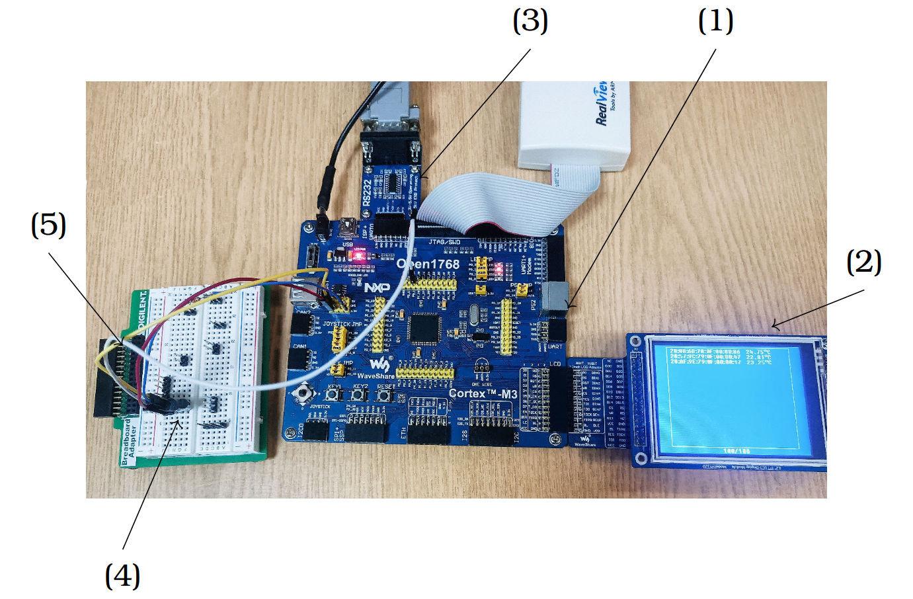
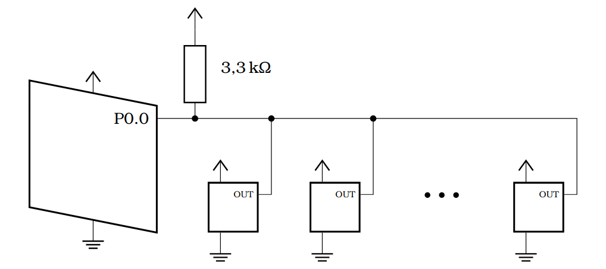
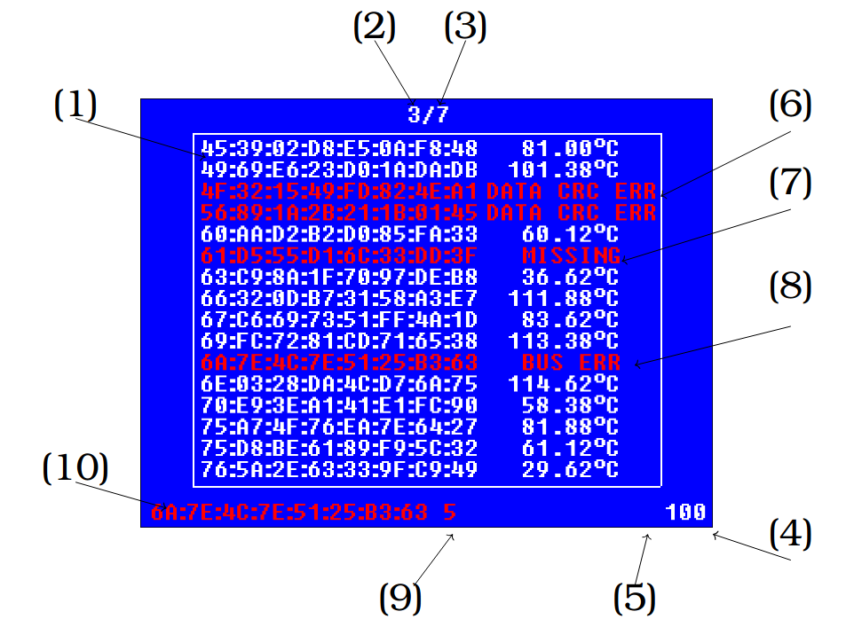

# Temperature Monitoring System with DS18B20 and UART Communication

## Project Overview

This project is designed to monitor temperatures using multiple DS18B20 sensors, display the readings on an LCD screen, and transmit them via UART to a computer for further analysis. The system is ideal for industrial environments, providing real-time temperature monitoring with an intuitive interface.

## Run Demo (Simulate an Embedded System)

```sh
mkdir build && cd build
cmake ..
make main && ./main
```

## Features

- Real-time temperature display on an LCD screen.
- Automatic detection of newly connected sensors.
- Retains disconnected sensors and marks them as unavailable.
- Resumes displaying data when a previously disconnected sensor is reconnected.
- Detects sensors using the 1-Wire device address scanning method.
- Transmits temperature readings via UART to a connected computer.

## Hardware Requirements

To assemble the system, you will need:
1. **Open1768 Evaluation Board** (with power supply).
2. **ILI9325 LCD Display** (for displaying temperature readings, connected via LCD interface).
3. **RS232 Module** (for UART communication, connected to UART0).
4. **DS18B20 Temperature Sensors** (multiple units).
5. **Breadboard, Jumper Wires and 3.3kΩ Pull-Up Resistor** (for 1-Wire communication).



## Setting Up

To connect DS18B20 sensors to the 1-Wire bus, follow these steps:

1. Connect all **power pins (VDD)** of the sensors to a **3.3V** power source.
2. Connect all **ground pins (GND)** of the sensors to the system **ground**.
3. Connect all **data pins (OUT)** of the sensors to a **single shared data wire**.
4. Attach a **3.3 kΩ pull-up resistor** between the data wire and the **3.3V power pin**.
5. Connect the **data wire** to **pin 0.0**.

Once properly connected, the circuit should match the schematic shown below, where the pull-up resistor is visible.



After physically connecting the sensors, follow these steps to start the application on your computer:

1. Connect the system to the computer by linking the **RS232 board output** to the computer’s **communication port** using a cable.
2. Ensure that the **serial port is correctly recognized** by the operating system and determine its **port name**.
3. Run the data reception script, specifying the correct port path:

```sh
python3 receive.py COM3          # Windows
python3 receive.py /dev/ttyUSB0  # Linux
```

4. Once the application starts, sensor data will be automatically transmitted and displayed in **real-time**.

## User Interface

Sensor data is displayed on the screen within a frame, where the thermometer's ROM address is shown on the left, and its current measurement or an error message is displayed on the right.

The system can store multiple sensors and displays the total number of recognized devices. The interface organizes all measurements into pages, each containing up to 16 devices. The currently displayed page is periodically incremented and loops back after the last page.



Explanation of the individual elements:

1. **Sensor ROM address:**
   - Displayed in **white** if the temperature was read successfully.
   - Displayed in **red** if the sensor is unavailable or an error occurred during reading.
2. **Currently displayed page.**
3. **Total number of pages.**
4. **Number of recognized devices.**
5. **Control symbol displayed before the number of devices:**
   - **"+" (plus)** appears when a new sensor is detected during the address scanning cycle.
   - **"/" (slash)** appears when the last page is displayed.
6. **CRC error message** in the received data.
7. **Sensor unavailable message** (sensor is disconnected from the bus).
8. **Bus error message** (conversion started successfully, but the bus was disconnected before reading the data).
9. **Number of errors** in the current address scanning cycle. When displaying the last page, this represents the total number of errors in the entire tree.
10. **Address of the last sensor** that encountered a reading error.

Additionally, a CRC error may occur in the device address itself. However, since this is likely caused by interference on the data bus, such devices will not be added to the list.

## Future Improvements

- Store known sensors in non-volatile memory for persistence across resets.
- Implement RTC-based timestamping for temperature readings.
- Save temperature logs for statistical analysis.
- Improve LCD update efficiency for smoother real-time display.
- Implement a low-power mode for energy efficiency.
